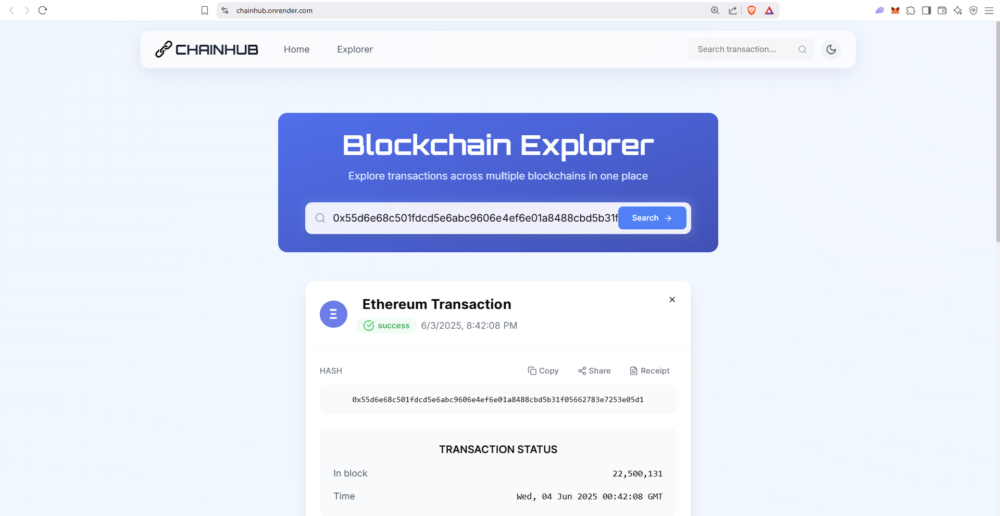

# 🚀 CHAINHUB

**CHAINHUB** is a powerful blockchain explorer that enables users to explore transactions across multiple blockchains including **Ethereum** and **Bitcoin** — all from a unified interface.

<div align="center">
  
</div>

# Demo Link:https://chainhub.onrender.com

---

## ✨ Features

- 🔗 **Multi-Chain Support** — Ethereum & Bitcoin
- ⚡ **Real-Time Data** — Live transaction status & info
- 🚀 **Fast & Reliable** — Optimized for performance and scalability
- 🌐 **Modern UI** — Built with Next.js and TailwindCSS
- 🔒 **Secure** — Uses trusted APIs like Etherscan & BscScan

---

## 🛠️ Tech Stack

- **Frontend:** Next.js, TypeScript, TailwindCSS
- **Blockchain APIs:** Etherscan, Blockstream
- **Infra Tools:** Render, Infura, REST APIs

---

## 🚀 Getting Started

### 1. Clone the Repository

```bash
git clone https://github.com/vinay-ponugoti/chainhub.git
cd chainhub

2. Add Environment Variables

NEXT_PUBLIC_ETHERSCAN_API_KEY=your_etherscan_api_key
NEXT_PUBLIC_BSCSCAN_API_KEY=your_bscscan_api_key

3. Install Dependencies & Run the App

npm install
npm run dev
Visit http://localhost:3000 to see CHAINHUB in action 🎉
